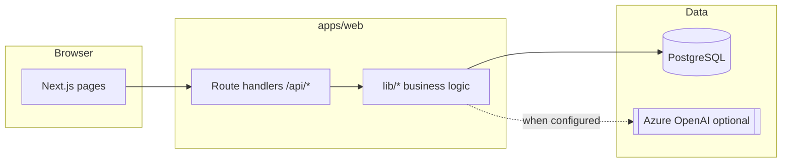

# Facelift Platform — Design & Technical Reference

This document describes the **facelift-platform** renovation marketplace application: architecture, major subsystems, and **where artificial intelligence (AI) is used**, including fallbacks when AI is unavailable.

---

## 1. Purpose & scope

**Facelift** connects **homeowners** who post renovation “projects” (selected catalog upgrades, photos, descriptions) with **contractors** who browse open work, place **line-item bids**, and exchange **clarifying messages**. **Admins** moderate users, contractor approval, bids, and projects.

The primary app lives under `apps/web` (Next.js App Router). The database schema and migrations live under `packages/database` (Prisma, PostgreSQL).

---

## 2. Technology stack

| Layer | Choice |
|--------|--------|
| Web framework | **Next.js** (App Router, React Server Components where applicable) |
| Language | **TypeScript** |
| Database | **PostgreSQL** |
| ORM | **Prisma** (client generated to `apps/web/generated/prisma`) |
| DB driver | **`pg`** with **Prisma Postgres adapter** (`@prisma/adapter-pg`) |
| Auth | **JWT** in **httpOnly** cookie (see `apps/web/lib/auth.ts`, `jose`) |
| Password hashing | **bcryptjs** |
| Styling | **Tailwind CSS** v4 |
| AI (optional) | **Azure OpenAI** via official **`openai`** SDK configured for Azure endpoints |

---

## 3. Repository layout

```
facelift-platform/
├── apps/web/                 # Next.js application (UI, API routes, lib/)
├── packages/database/        # prisma/schema.prisma, migrations, optional seed
├── docs/                   # This document and other design notes
└── .env                    # Often at repo root; DATABASE_URL and secrets
```

**Prisma** is invoked from `packages/database`; the generated client is written to `apps/web/generated/prisma` per `schema.prisma` `generator.output`.

---

## 4. High-level architecture



- **Server-rendered pages** load data via Prisma in Server Components or call internal `lib/*` helpers.
- **API routes** enforce session/role checks, then mutate or query Prisma.
- **AI** is never required for core transactional flows; it **augments** gallery, cost explainers, and note drafting when `AZURE_OPENAI_*` is set.

---

## 5. Roles & routing

| Role | Dashboard entry | Notes |
|------|------------------|--------|
| `HOMEOWNER` | `/dashboard/homeowner` | Owns `Project` rows; sees contractor **decrypted** company names where appropriate. |
| `CONTRACTOR` | `/dashboard/contractor` | Browses open projects; sees **peer anonymized** labels for competing bids; own company name decrypted on own dashboard. |
| `ADMIN` | `/dashboard/admin` | Full directory, moderation, approvals. |

Post-login redirect: `apps/web/lib/auth-routing.ts` (`dashboardPathForRole`).

---

## 6. Data model (conceptual)

Key entities (see `packages/database/prisma/schema.prisma` for full definitions):

- **User** — `email`, `role`, `passwordHash`; links to profiles and activity.
- **HomeownerProfile** — optional `fullName`, `phone`.
- **ContractorProfile** — company identity stored with **`companyNameEncrypted`** (AES-256-GCM); legacy optional `companyName`; `approvalStatus`, `serviceZipCodes`, etc.
- **Project** — homeowner scope: `title`, `description`, `notesForContractors`, `zipCode`, `status`, `adminNotes`, photos, items.
- **ProjectItem** — catalog line with `selectedOptions`, optional per-line `notes`.
- **Bid** / **BidLineItem** — one bid per `(projectId, contractorId)`; line amounts sum to total.
- **ProjectContractorMessage** — contractor → homeowner questions on a project or line.
- **PlatformFeedback** — homeowner/contractor → admin support-style messages (category, body, optional `projectId`).
- **Catalog** — `CatalogCategory`, `CatalogItem`, `GalleryImage` for merchandised upgrades and inspiration images.

---

## 7. Security & privacy highlights

- **Sessions**: JWT in httpOnly cookie; server validates via `getSession` / `getSessionFromRequest`.
- **Contractor company names at rest**: encrypted in `ContractorProfile.companyNameEncrypted` (`apps/web/lib/contractor-company-name.ts`). Decryption for **homeowners**, **admins**, and **contractors viewing themselves**; **peer contractors** see stable labels like `Bidder A3F2` (`peerBidderLabel`) when comparing others’ bids.
- **Environment keys**: `CONTRACTOR_COMPANY_NAME_KEY` (32-byte key) for encryption; optional `CONTRACTOR_PEER_LABEL_SALT` for HMAC-based peer labels.

---

## 8. Artificial intelligence (AI) — detailed

All production AI calls go through **one integration point**: `apps/web/lib/azure-openai.ts`.

### 8.1 Configuration

| Variable | Purpose |
|----------|---------|
| `AZURE_OPENAI_ENDPOINT` | Azure resource URL (e.g. `https://<resource>.openai.azure.com`) |
| `AZURE_OPENAI_API_KEY` | API key |
| `AZURE_OPENAI_DEPLOYMENT` | Deployment name (e.g. chat model) |
| API version | `2024-08-01-preview` (in code) |

`isAzureOpenAIConfigured()` returns true only when **endpoint, deployment, and API key** are all set. If not, **no remote AI calls** are made; features use deterministic or template fallbacks.

The client is a **lazy singleton** on `globalThis` to avoid reconnecting in dev.

---

### 8.2 AI feature matrix

| # | Feature area | Source file(s) | Trigger | Model usage | Output | Fallback when AI off / fails |
|---|----------------|----------------|--------|-------------|--------|------------------------------|
| 1 | **Style tags for gallery ranking** | `lib/project-gallery.ts` — `getStyleTagsFromAI` | Building/ranking gallery for a project | Chat completion: system prompt asks for **3–5 lowercase one-word style tags** from title, description, catalog names, optional per-line homeowner notes | Comma-separated tags → parsed to string array | Empty array; gallery still works from catalog match + ordering rules |
| 2 | **Gallery image picks + keywords** | `lib/project-gallery.ts` — `pickAndKeywordGalleryWithAI` | Curating top gallery picks for a project | Chat completion: JSON only `{ picks: [{ id, rank, keywords, reason }] }` from project context + candidate images | Structured picks with keywords and optional reason | No AI picks; other gallery logic applies |
| 3 | **Unsplash search queries (gallery seed)** | `lib/project-gallery.ts` — `getSearchQueriesFromAI` | When seeding empty gallery via Unsplash | Chat completion: JSON `{ queries: [...] }` for renovation photo searches | Array of search strings | Fixed default queries in code |
| 4 | **Bid benchmark explainer** | `lib/project-cost.ts` — `tryAiExplainer` | After stats (avg/min/max bid totals in zip) are computed from **real DB aggregates** | Chat completion: system + user prompt; must return **JSON** `summary` + `bullets`; instructions forbid inventing dollar amounts beyond provided stats | Parsed JSON merged into `EstimateExplainer` | `buildDeterministicExplainer()` — fixed copy from the same numbers |
| 5 | **Note assistant (homeowner & contractor)** | `lib/note-assistant.ts` — `suggestNoteWithAi` | User clicks “Suggest … (assistant)” on support flows | Chat completion: role-specific system prompt; user payload JSON with project context + optional draft | Plain text note/cover letter | `suggestNoteFallback()` templates (bullet lists / letter skeletons) |

**Important**: For **cost explainers**, numeric benchmarks are always computed in application code from **historical bid data**; AI only rephrases explanation under strict rules. If parsing fails, deterministic text is used.

---

### 8.3 API routes that invoke AI (indirectly)

AI is **not** exposed as a standalone public “chat” endpoint for anonymous users. It is invoked from **server-side libraries** when:

- Gallery refresh / project gallery helpers run (`lib/project-gallery.ts`).
- Cost estimate is requested (`getProjectCostEstimate` in `lib/project-cost.ts`).
- A logged-in user calls **`POST /api/projects/[id]/suggest-note`** (`apps/web/app/api/projects/[id]/suggest-note/route.ts`), which calls `suggestNote()` in `lib/note-assistant.ts` (AI optional, template fallback always possible).

---

### 8.4 Non-AI “smart” behavior

- **Bid comparison / gap detection** (`lib/bid-comparison.ts`): purely **deterministic** rules (scope gaps at $0, spread %, schedule spread, etc.) — **no LLM**.
- **Peer bidder labels**: **HMAC-SHA256**-style labeling (`peerBidderLabel`) — not generative AI.

---

## 9. Notable API surface (non-exhaustive)

| Area | Example route | Auth |
|------|----------------|------|
| Auth | `POST /api/auth/login`, `POST /api/auth/signup`, `POST /api/auth/logout` | Public / sets cookie |
| Projects (homeowner) | `PATCH /api/projects/[id]`, `PATCH /api/projects/[id]/contractor-notes` | Homeowner |
| Contractor bid | `POST /api/projects/[id]/contractor/bid` | Approved contractor |
| Messages | `POST /api/projects/[id]/contractor/messages` | Approved contractor |
| Suggest note | `POST /api/projects/[id]/suggest-note` | Homeowner owner or eligible contractor |
| Platform feedback | `POST /api/platform-feedback` | Homeowner / contractor (if implemented) |
| Admin | `/api/admin/*` | Admin session |

---

## 10. External services (non-AI)

- **Unsplash** (optional): `UNSPLASH_ACCESS_KEY` for fetching stock URLs when seeding gallery images (`project-gallery.ts`). Independent of Azure OpenAI, though AI can suggest search queries when both are configured.

---

## 11. Operational notes

- **Migrations**: run from `packages/database` (`prisma migrate deploy` / `migrate dev`).
- **Prisma generate**: after schema changes, regenerate client to `apps/web/generated/prisma`.
- **Backfill**: `apps/web/scripts/backfill-contractor-company-encryption.ts` migrates legacy plaintext company names after encryption key is configured.
- **Environment**: Production should set DB URL, JWT/session secrets, `CONTRACTOR_COMPANY_NAME_KEY`, and optionally full `AZURE_OPENAI_*` for AI-enhanced UX.

---

## 12. Extension points

- New **catalog items** and **gallery** content are data-driven via Prisma.
- Additional **AI features** should reuse `getAzureOpenAI()` / `isAzureOpenAIConfigured()` and keep **non-AI fallbacks** for reliability and cost control.
- **Admin directory** (`/dashboard/admin/directory`) centralizes user visibility for support.

---

*Document generated to reflect the codebase structure and AI touchpoints; update this file when adding new LLM features or changing integration boundaries.*
